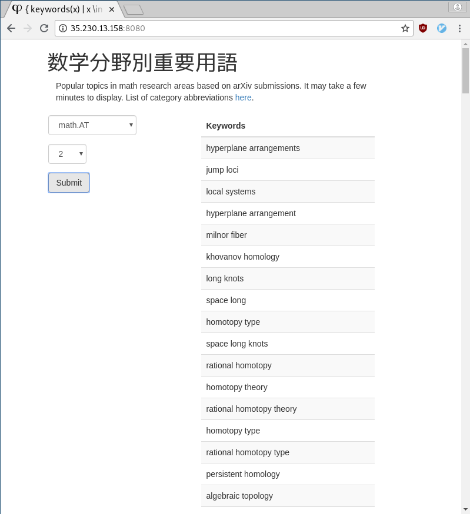

Note to myself:

- environment
      * install git, pip, redis, and postgres
      * clone the repo
      * `pip install -r requirements.txt`
      * `nltk.download('stopwords')` in a python shell

- db (local):
      * install and initialize postgres. enable and start in systemctl
      * add user via createuser --interactive after sudo -u postgres -i
      * `create database arxiv\_project;` in psql
      * set `DATABASE\_URL=postgresql://localhost/arxiv_project` (or postgresql:///arxiv_project , if psycopg throws a no password supplied error) in .envrc
      * python manage.py db {init,migrate,upgrade}
      * metha_to_postgres.py to populate rows
      * start redis-server

- run (local):
      * python worker.py
      * python manage.py runserver
      * test local deploy with heroku local

- deploy (heroku):
      * heroku create appname-{stage,pro}
      * git remote add {stage,pro} git@heroku.com:appname-{stage,pro}.git; then push.
      * heroku config:set APP_SETTINGS=config.StagingConfig --remote stage
      * heroku addons:create heroku-postgresql:hobby-dev --app appname-stage
      * (heroku config --app appname-stage to check config)
      * heroku run python manage.py db upgrade --app appname-stage ( migrations/ should be pushed )
      * heroku addons:create redistogo:nano --app appname-stage
      * Procfile calls heroku.sh to run gunicorn and worker.py

- db (heroku; 10,000 rows limit with hobby-dev) to populate postgres with arxiv data:
      * pg_dump -U postgres -Fc --no-acl --no-owner arxiv_project > arxiv_project.dump
      * Upload arxiv_project.dump somewhere
      * heroku pg:backups:restore 'url/to/arxiv_project.dump' DATABASE_URL --app appname-stage;
        Try http instead of https if download fails.

- deploy (GCP):
      * clone the arxiv-project repo.
      * see arxiv-startup.sh

- extra:
      * nltk.txt in root to fetch corpora (or create and push nlkt\_data dir)
      
- Reference:
      * Real Python - Flask by Example
      * Alembic Tutorial (official)
      * Heroku Postgres - Import/Export
      * Vuejs guide (official)
